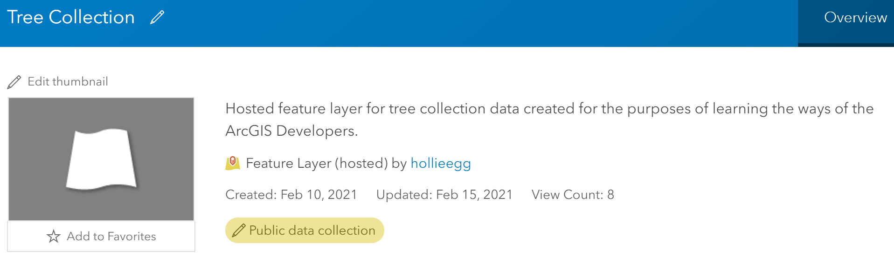

# ArcGIS Online Developers

## Create a new empty layer on ArcGIS Developers
My Layer URL (Rest End Point) https://services3.arcgis.com/g473T2x9MwNyjrnj/arcgis/rest/services/tree_collection/FeatureServer

Item ID
845e89a2a4fa41d9b7f8ff836fe0359c

## Using a webmap 

### Item ID URL for hosted Feature Layer
845e89a2a4fa41d9b7f8ff836fe0359c
### REST URL
Compared to Deveopers RestURL.... For the webmap hosted layer there is a 0 on the end of the URL..Which states the layer number. Other than that the URL is the same. 
https://services3.arcgis.com/g473T2x9MwNyjrnj/arcgis/rest/services/tree_collection/FeatureServer/0

Changed the editing controls

# BONUS: Compare template experience

Differences between the Developers and Main AGOL template creation experience. 

Both will create a feature layer but in slightly different ways and give different user experience. HEre are the main difference that stuck out for me. 

ArcGIS Develeper

    - Gives more options to change things 
	- Can Add Coorordinate systems
	- Feels a lot more natural 
	- Able to add fields when initially creating the layer 
	
ArcGIS Online

	- Can use templates or build from scratch. 
	- Different User experience/ interface
	- Doesn’t give ability to define fields from initial set up. Added after set up by clicking the data tab.
	- A lot of fields created by arcGIS for us. 

