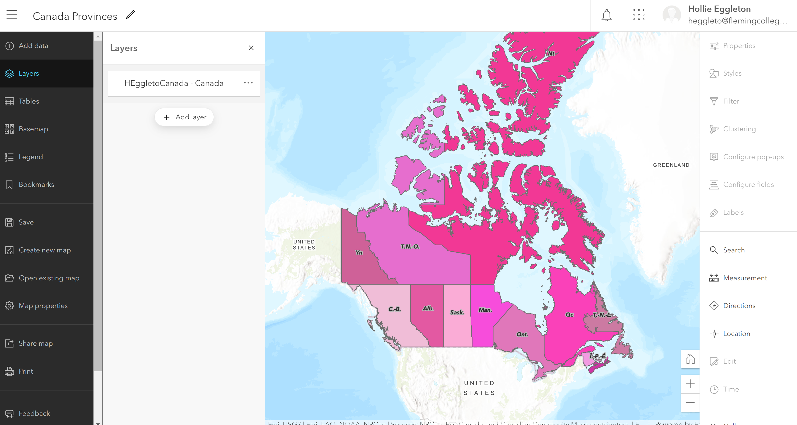
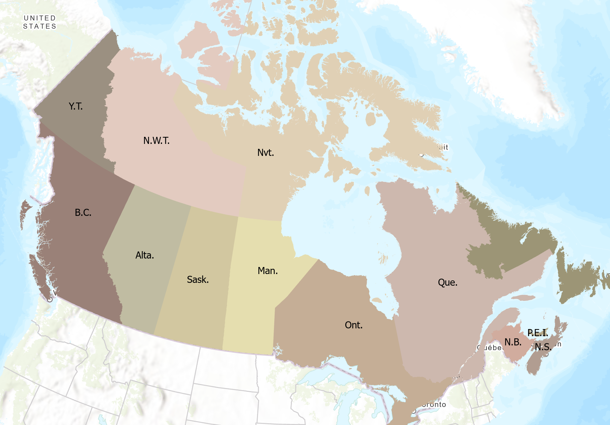

# ArcGIS Server

## Item 1
Completed - Publishing data using ArcGIS Pro to ArcGIS Server

## Item 2
### Uploading to ArcGIS Onlie
Review questions: 
Yes the map projection changed. 
I changed(overode) its cartography in ArcGIS Online Beta Map. I did this by 
adding labels and configuring the pop up info/boxes.

## Item 3
### REST URL in ArcGISPro
Added the REST endpoint URL for my map service into ArcGISPro directly and then also browsed the items to add the item that way. Experimented with the cartographic options that were available for each in ArcGISPro. Saved a newly styled map. 

## Item 4 
Using a wrapper for my new Canada Map service to educate elementary children (7-10 years of age) on the Provinces of Canada.
For this I wanted to try a new technique and explore ESRI Online Templates. For this Ineeded to make a web map and then download the template. I forked/cloned this to deploy it in my github and altered the JS file to alter it.

URL: https://hollieegg.github.io/canadianmap/index.html

## Item 5 
Readings.

## Item 6
### Publishing to ArcGIS Online Organization
Upon sharing the same webmap that was published to Luna, to ArcGIS Online as a webmap, two other items have also been created- A feature Layer and a Service Definition layer. The Service Definition layer shows metadata of the map. Data such as tags were also copied over from ArcGISPro. 

Screenshots of process:

